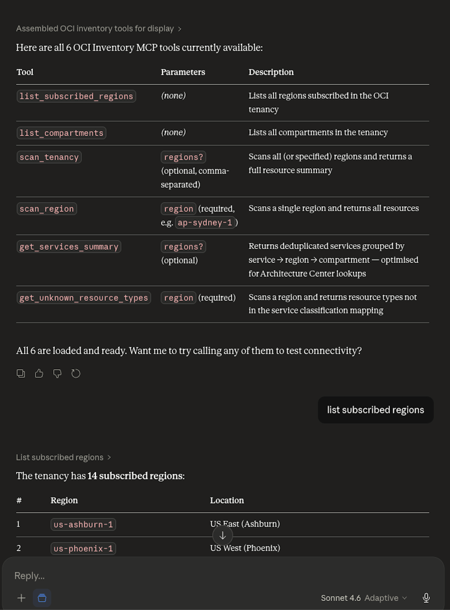
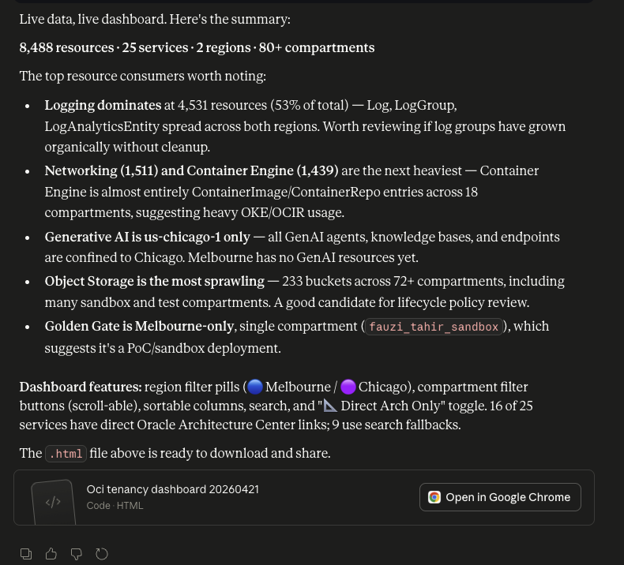
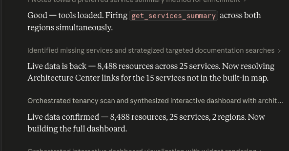
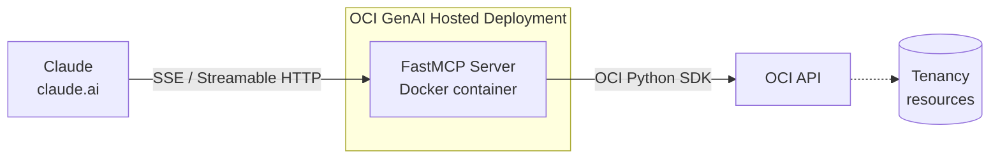

# OCI Inventory MCP

*A Model Context Protocol server that scans your Oracle Cloud Infrastructure tenancy and renders an interactive inventory dashboard inside Claude.*


<!-- TODO: LICENSE file in this repo is currently Unlicense (public domain), not MIT.
           Update LICENSE to MIT to match this badge, or change the badge. -->

---

## What is it?

**OCI Inventory MCP** is a [FastMCP](https://github.com/modelcontextprotocol/python-sdk) server that exposes Oracle Cloud Infrastructure resource scanning as a set of MCP tools. It runs over Streamable HTTP, supports Resource Principal, Instance Principal and `~/.oci/config` authentication, and is packaged for OCI Generative AI Hosted Deployments, OCI Container Instances / VMs, or local development.

When connected to Claude, the server feeds live tenancy data into the bundled [`oci-tenancy-dashboard`](chats/skills/oci-tenancy-dashboard.skill) skill, which renders a dark-themed, sortable, filterable inventory dashboard — grouped by service, with region tags, compartment filter buttons and direct links into the Oracle Architecture Center for every service in use.

## Screenshots







A previously generated dashboard is checked in at [examples/oci-tenancy-dashboard-20260421.html](examples/oci-tenancy-dashboard-20260421.html) for reference.

## Quick Start — Get Your OCI Dashboard in 3 Steps

1. **Clone & configure**

   ```bash
   git clone https://github.com/aszynkow/oci_hosted_mcp.git
   cd oci_hosted_mcp/hosted_app
   # Edit deploy_config.yaml — fill in tenancy_id, compartment_id,
   # identity_domain.url, container.tenancy_namespace, container.username.
   ```

   Create a Python virtualenv and install the runtime dependencies for the
   automation scripts (`deploy.py`, `destroy.py`, `get_token.py`). Do this
   **before** running any `python …` command in the steps below:

   ```bash
   python3 -m venv .venv && .venv/bin/pip install oci requests pyyaml
   ```

   Then either activate the venv (`source .venv/bin/activate`) or invoke the
   scripts via `.venv/bin/python` so they pick up the installed packages.

2. **Build, push and deploy**

   Before running `deploy.py`, populate the required fields in [hosted_app/deploy_config.yaml](hosted_app/deploy_config.yaml). The file ships with empty placeholders that the script will refuse to deploy with:

   ```yaml
   oci:
     profile: DEFAULT                       # OCI config profile name
     region: us-phoenix-1                   # OCI region
     compartment_id: ""                     # ← REQUIRED — compartment to deploy into
     tenancy_id: ""                         # ← REQUIRED — your tenancy OCID

   identity_domain:
     url: ""                                # ← REQUIRED — Console → Identity → Domains → Domain URL
     # app_id / client_id / client_secret are populated by the script

   oauth:
     app_name: oci-mcp-inventory
     audience: oci-mcp-inventory
     scope: invoke

   genai_application:
     name: oci-mcp-inventory
     min_replicas: 1
     max_replicas: 3
     scaling_metric: CONCURRENCY
     scaling_threshold: 10

   container:
     registry: phx.ocir.io                  # OCIR endpoint — must match your region
     tenancy_namespace: ""                  # ← REQUIRED — run: oci os ns get
     username: name.surname@oracle.com      # ← REQUIRED — your Oracle Cloud login email
     repository: oci-mcp-inventory
     tag: latest
     build_context: ../container
     ocir_token: ""                         # ← REQUIRED (or leave blank to be prompted at runtime)
                                            #   Console → Identity → Users → <you> → Auth Tokens → Generate
   iam:
     existing_dynamic_group: ""             # Optional — set if tenancy DG limit is hit
   ```

   Required fields to fill in before deploy:

   | Field | How to find it |
   |---|---|
   | `oci.compartment_id` | Console → Identity → Compartments → *your compartment* → OCID |
   | `oci.tenancy_id` | Console → top-right profile → Tenancy → OCID |
   | `identity_domain.url` | Console → Identity → Domains → *your domain* → Domain URL |
   | `container.tenancy_namespace` | `oci os ns get` |
   | `container.username` | Your Oracle Cloud login email |
   | `container.ocir_token` | Console → Identity → Users → *your user* → Auth Tokens → Generate (or leave blank to be prompted) |

   Then run:

   ```bash
   python deploy.py
   ```

   This builds the container in [container/](container/), pushes it to OCIR, creates the Identity Domain OAuth app, IAM dynamic group + policy, and a GenAI Hosted Application + Deployment. To run the server locally instead:

   ```bash
   docker build -t oci-inventory-mcp ./container
   docker run --rm -p 8080:8080 \
     -e OCI_AUTH=auto \
     -v ~/.oci:/home/mcpuser/.oci:ro \
     oci-inventory-mcp
   ```

   <!-- TODO: No docker-compose.yml is present in the repo. Add one if a compose-based
              workflow is desired, or remove this note. -->

3. **Set up Claude Desktop**

   a. Run the Claude Desktop setup wizard:

   ```bash
   python get_token.py --setup-claude
   ```

   This generates a wrapper script `claude_wrapper.sh`. Add the following block to your Claude Desktop `claude_desktop_config.json` (replace `<path>` with the absolute path printed by the script):

   ```json
   {
     "mcpServers": {
       "oci-inventory": {
         "command": "/bin/bash",
         "args": ["<path>/claude_wrapper.sh"]
       }
     }
   }
   ```

   Restart Claude Desktop. The **oci-inventory** tools will appear in the tools panel.

   > 💬 **Try it — paste this into Claude Desktop or Cline:**
   >
   > ```text
   > Scan my OCI tenancy across ap-melbourne-1 and us-chicago-1 and generate the
   > interactive dashboard — include compartment filters and Oracle Architecture
   > Center links.
   > ```

4. **Set up Cline (VS Code)**

   a. Run:

   ```bash
   python get_token.py --setup-cline
   ```

   This prints a ready-to-paste JSON block and saves a sample config file to `chats/cline/mcp_config.json`.

   b. Open (or create) your Cline MCP settings file and merge in the generated block:

   ```json
   {
     "mcpServers": {
       "oci-inventory": {
         "autoApprove": [],
         "disabled": false,
         "timeout": 60,
         "type": "streamableHttp",
         "url": "https://<endpoint>/<your-app-ocid>/actions/invoke",
         "headers": {
           "Authorization": "Bearer <token-from-get_token.py>"
         }
       }
     }
   }
   ```

   > ⚠️ **Never commit a real Bearer token.** The `get_token.py` script refreshes tokens automatically; treat them like passwords.
   >
   > ⏱ **Token lifetime is 24 hours by default.** This is set on the confidential app in the Identity Domain (IDCS): Console → Identity → Domains → *your domain* → Integrated applications → `oci-mcp-inventory` → Resource server configuration → **Access token expiration**. Increase it there if you need a longer-lived token; rerun `python get_token.py` to mint a new one once the change is saved.

   A working sample file (with a redacted token) is stored at `chats/cline/mcp_config.json` for reference.

   <!-- TODO: chats/cline/cline_mcp_settings.json currently contains a live Bearer
              token. Rename to chats/cline/mcp_config.json and redact the token
              before publishing this repo. -->

   c. Reload the Cline MCP servers panel. `oci-inventory` will appear as an active server.

## Example Prompts

<!-- TODO: examples/ currently contains a rendered dashboard artifact
           (oci-tenancy-dashboard-20260421.html), not chat prompt files.
           Add .md or .txt prompt samples to examples/ to populate this section. -->

The prompts below exercise different tools in the server.

**Full multi-region scan with dashboard render**

```text
Scan my OCI tenancy across ap-melbourne-1 and us-chicago-1 and generate the
interactive dashboard — include compartment filters and Oracle Architecture
Center links.
```

**Service-level summary for architecture review**

```text
Use get_services_summary to list every OCI service I'm currently using,
then map each one to the most relevant Oracle Architecture Center reference
architecture.
```

**Find unclassified resource types**

```text
Run get_unknown_resource_types against ap-sydney-1 and report any
resource types that aren't in the built-in service mapping.
```

## Available MCP Tools

Defined in [container/server.py](container/server.py).

| Tool | Description | Key Parameters |
|---|---|---|
| `list_subscribed_regions` | List all regions subscribed in the OCI tenancy. | *(none)* |
| `list_compartments` | List every compartment in the tenancy with OCID + name. | *(none)* |
| `scan_region` | Scan a single OCI region and return all resources, grouped by service. | `region` *(required, e.g. `ap-sydney-1`)* |
| `scan_tenancy` | Scan all (or specified) OCI regions and return a full resource summary. | `regions` *(optional, comma-separated)* |
| `get_services_summary` | Deduplicated summary of OCI services in use, grouped by service → regions → compartments. Optimised as input for Architecture Center lookups. | `regions` *(optional, comma-separated)* |
| `get_unknown_resource_types` | Scan a region and return any resource types not in the built-in service classification map. | `region` *(required)* |

## Skills

Drop these `.skill` files into a Claude Project (Projects → Skills → Upload) to teach Claude how to use the MCP server.

#### oci-tenancy-dashboard

Builds the interactive HTML dashboard visualising OCI tenancy resources pulled live from the connected OCI MCP server. Triggers on phrases like *"show my OCI resources"*, *"what's in my tenancy"*, *"OCI inventory"*, *"scan my tenancy"*.

```text
chats/skills/oci-tenancy-dashboard.skill
```

#### orcl-docs-search

Forces live Oracle web-search lookups for any Oracle product, documentation, architecture, pricing, customer or contract question — used by the dashboard skill to resolve Architecture Center links per service.

```text
chats/skills/orcl-docs-search.skill
```

## Deployment

All automation lives in [hosted_app/](hosted_app/) and is driven from [hosted_app/deploy_config.yaml](hosted_app/deploy_config.yaml). Each script is invoked as `python <script>` from inside `hosted_app/`.

#### deploy.py

End-to-end deploy: Docker build + push to OCIR → Identity Domain OAuth app → IAM dynamic group + policy → GenAI Hosted Application + Deployment.

```bash
usage: deploy.py [-h] [--config FILE] [--step STEP] [--skip-docker]
                 [--image-only] [--skip-login] [--add-artifact]
                 [--deployment-id OCID] [--image REGISTRY/NS/REPO] [--tag TAG]
                 [--status] [--force-step STEP] [--reset] [--reset-step STEP]

OCI MCP Server — full deploy automation (build → push → infra)

options:
  -h, --help            show this help message and exit
  --config FILE         Path to deploy_config.yaml (default:
                        deploy_config.yaml)
  --step STEP           Step to run: all | docker | validate | oauth | iam |
                        genai_app | genai_deploy

Docker options:
  --skip-docker         Skip docker build+push (image must already be in OCIR)
  --image-only          Build+push image only — do not run any infra steps
  --skip-login          Skip 'docker login' to OCIR (already logged in this
                        session)

Add artifact (update existing deployment):
  --add-artifact        Push new image (unless --skip-docker) and update an
                        existing deployment
  --deployment-id OCID  Deployment OCID to update (reads deploy_output.json if
                        omitted)
  --image REGISTRY/NS/REPO
                        Override container image path (reads
                        deploy_config.yaml if omitted)
  --tag TAG             Override container image tag (reads deploy_config.yaml
                        if omitted)

Resume tracking:
  --status              Show which steps have completed then exit
  --force-step STEP     Force re-run a specific step even if already marked
                        complete
  --reset               Clear all resume tracking in deploy_output.json then
                        exit
  --reset-step STEP     Clear resume tracking for one step then exit

Steps (--step):
  all           Docker build+push + all infra steps  (default)
  docker        Docker build+push only
  validate      Config + OCI connectivity check only
  oauth         Identity Domain OAuth app
  iam           IAM dynamic group + policy
  genai_app     GenAI Hosted Application
  genai_deploy  GenAI Hosted Deployment (container)
```

**Prerequisites:** `oci`, `requests`, `pyyaml` Python packages; `docker` CLI logged into your target OCIR; a populated `deploy_config.yaml`; an OCI Auth Token (Console → Identity → Users → *your user* → Auth Tokens) for `docker login`.

#### destroy.py

Reverse of `deploy.py`. Tears resources down in dependency order. Defaults to dry-run — pass `--confirm` to actually delete.

```bash
usage: destroy.py [-h] [--config FILE] [--step STEP] [--confirm]
                  [--delete-image]

OCI MCP Server — full teardown (reverse of deploy.py)

options:
  -h, --help      show this help message and exit
  --config FILE   Path to deploy_config.yaml (default: deploy_config.yaml)
  --step STEP     Single step to destroy: genai_deploy | genai_app |
                  iam_policy | iam_dg | oauth | ocir
  --confirm       Actually delete resources (default is dry-run)
  --delete-image  Also delete the OCIR repository and all its images

Steps (--step):
  genai_deploy  Delete GenAI Hosted Deployment
  genai_app     Delete GenAI Hosted Application
  iam_policy    Delete IAM Policy
  iam_dg        Delete IAM Dynamic Group  (skipped if pre-existing)
  oauth         Delete Identity Domain OAuth App
  ocir          Delete OCIR repository + all images  (requires --delete-image)
```

**Prerequisites:** Same as `deploy.py`. Reads OCIDs from `deploy_output.json` produced by the deploy step.

#### get_token.py

Fetches an OAuth bearer token from the Identity Domain confidential app, optionally tests the SSE endpoint, and writes ready-to-use Claude / Cline MCP client configs.

```bash
usage: get_token.py [-h] [--output OUTPUT] [--export] [--test]
                    [--setup-claude] [--setup-cline] [--dir DIR]
                    [--client-secret CLIENT_SECRET]

options:
  -h, --help            show this help message and exit
  --output OUTPUT
  --export              Print export statement
  --test                Test SSE endpoint after getting token
  --setup-claude        Generate claude_wrapper.sh
  --setup-cline         Generate cline_mcp_settings.json
  --dir DIR             Output dir override (default varies per --setup-*
                        flag)
  --client-secret CLIENT_SECRET
                        Override client_secret (if not stored in
                        deploy_output.json)
```

**Prerequisites:** `requests`, `pyyaml` Python packages; a successful `deploy.py` run that produced `deploy_output.json` with the deployment URL and OAuth client credentials.

## Configuration Reference

Runtime environment variables read by [container/server.py](container/server.py):

| Variable | Required | Default | Description |
|---|---|---|---|
| `OCI_AUTH` | No | `resource_principal` | Auth mode: `resource_principal` (Hosted Deployment), `instance_principal` (VM/Container Instance), `auto` (try RP → IP → `~/.oci/config`). |
| `OCI_RESOURCE_PRINCIPAL_REGION` | No | *(home region of tenancy)* | Override the region the server uses for OCI API calls. |
| `MCP_HOST` | No | `0.0.0.0` | Bind address for the local/compose entry point. |
| `MCP_PORT` | No | `8080` | Bind port for the local/compose entry point. *(Reserved on OCI Hosted Deployment — the platform sets `PORT`.)* |

Deployment-time configuration lives in [hosted_app/deploy_config.yaml](hosted_app/deploy_config.yaml) and covers `oci.*`, `identity_domain.*`, `oauth.*`, `genai_application.*`, `container.*` and `iam.*` blocks.

<!-- TODO: No .env.example file is present in the repo. Add one mirroring the
           variables in this table if a dotenv-style workflow is desired. -->

## OCI Permissions

`deploy.py` creates one dynamic group and one IAM policy in the tenancy root.

**Dynamic group** — `oci-mcp-genai-dg` (or the name set in `iam.existing_dynamic_group`):

```text
ALL {resource.compartment.id = '<oci.compartment_id>', resource.type = 'genaihosteddeployment'}
```

**Policy** — `oci-mcp-genai-policy`, with a single statement:

```text
Allow dynamic-group oci-mcp-genai-dg to read all-resources in tenancy
```

The `Search` service used by `scan_region` / `scan_tenancy` honours the caller's `read` permission per resource type — anything the dynamic group cannot read is silently omitted from results.

**Vulnerability-scan policies (manual — not created by `deploy.py`)**

OCI Generative AI Hosted Deployments will only succeed once the container image has been scanned by OCI Vulnerability Scanning Service (VSS) and the platform can read the scan results. Add the following three statements to a policy in the same compartment as your container image — `deploy.py` does **not** create them for you:

```text
Allow dynamic-group oci-mcp-genai-dg to read repos in compartment id <oci.compartment_id>
Allow dynamic-group oci-mcp-genai-dg to read container-scan-results in compartment id <oci.compartment_id>
Allow dynamic-group oci-mcp-genai-dg to read vss-family in compartment id <oci.compartment_id>
```

Replace `<oci.compartment_id>` with the value from [hosted_app/deploy_config.yaml](hosted_app/deploy_config.yaml).

## Architecture



Auth flow: Claude obtains an OAuth bearer token from the Identity Domain confidential app, presents it to the GenAI Hosted Deployment ingress, which forwards the request to the container. Inside the container, the server uses the injected Resource Principal to call OCI APIs — no static credentials are stored on disk.

## Contributing & License

Contributions are welcome. Please open an issue describing the change before sending a pull request, especially for additions to the `RESOURCE_TYPE_TO_SERVICE` map in [container/server.py](container/server.py) (use `get_unknown_resource_types` to surface gaps).

Release notes for the deployment automation are tracked in [CHANGELOG.md](CHANGELOG.md).

Released under the MIT License. See [LICENSE](LICENSE) for details.

<!-- TODO: LICENSE file currently contains Unlicense text. Replace with the
           standard MIT License text to match this section and the badge above. -->

## References

- [OCI Generative AI — Hosted Deployments](https://docs.oracle.com/en-us/iaas/Content/generative-ai/deployments.htm) — official Oracle documentation for the deployment surface this server targets.
