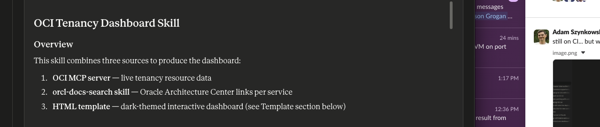

# OCI Inventory MCP Hosted Deployment

Easily deploy the OCI Inventory MCP Server as a hosted application on Oracle Cloud Infrastructure (OCI) using Docker. This solution automates resource scanning and exposes secure HTTPS endpoints for integration with AI and automation platforms.

## What gets automated

| Step | What | How |
|------|------|-----|
| 0 | Docker build + push to OCIR | `deploy.sh` |
| 1 | Validate OCI config + connectivity | `deploy.py` |
| 2–4 | Create Identity Domain confidential app, configure OAuth (audience, scope, client credentials), activate | `deploy.py --step oauth` |
| 5–6 | Create IAM dynamic group + policy for Resource Principal | `deploy.py --step iam` |
| 7 | Create GenAI Hosted Application (scaling, auth wiring, env vars) | `deploy.py --step genai_app` |
| 8 | Create + activate GenAI Hosted Deployment (container image) | `deploy.py --step genai_deploy` |

## Prerequisites

- OCI CLI installed and `~/.oci/config` configured
- Docker installed and running ([Get Docker](https://docs.docker.com/get-docker/))
- Python 3.11+
- Podman installed: `brew install podman && podman machine init && podman machine start`

## Setup

```bash
chmod +x deploy.sh
python3 -m venv .venv
.venv/bin/pip install -r requirements.txt
```

## Configure

Edit `deploy_config.yaml` — at minimum fill in:

```yaml
oci:
  region: ap-sydney-1
  compartment_id: ocid1.compartment.oc1..YOUR_COMPARTMENT
  tenancy_id: ocid1.tenancy.oc1..YOUR_TENANCY

identity_domain:
  url: https://idcs-XXXXXXXXXXXXXXXX.identity.oraclecloud.com

container:
  registry: syd.ocir.io
  tenancy_namespace: YOUR_NAMESPACE   # oci os ns get
```

Get your tenancy namespace:
```bash
oci os ns get --profile DEFAULT
```

## Run

Full deploy (build + push + all infra):
```bash
./deploy.sh
```

Infra only (image already in OCIR):
```bash
./deploy.sh --skip-podman
```

Individual steps (idempotent — safe to re-run):
```bash
python .venv/bin/python deploy.py --step oauth
python .venv/bin/python deploy.py --step iam
python .venv/bin/python deploy.py --step genai_app
python .venv/bin/python deploy.py --step genai_deploy
```

## Get a token + test

```bash
# Print token
python get_token.py

# Export to env var
eval $(python get_token.py --export)

# Get token AND test the SSE endpoint
python get_token.py --test

# If client_secret not in deploy_output.json (copy from Console)
python get_token.py --client-secret YOUR_SECRET --test
```

## Add to Claude


After deploy, `deploy_output.json` contains the endpoint URL and token details.
Add to Claude.ai → Settings → Integrations:

```
URL:    https://<endpoint>/sse
Header: Authorization: Bearer <token from get_token.py>
```

## Output files

| File | Contents |
|------|----------|
| `deploy_output.json` | All resource OCIDs, client_id, client_secret, endpoint URL |


**Store `deploy_output.json` securely** — it contains the client secret.
For production, move the secret to OCI Vault.

---

## Quick Start with Docker

### 1. Clone the Repository


```sh
git clone https://github.com/your-org/oci-inventory-mcp-hosted.git
cd oci-inventory-mcp-hosted
```

### 2. Configure OCI Credentials


- Edit `deploy_config.yaml` with your tenancy, compartment, and domain details.
- Make sure your user has permissions to deploy and run containers.

### 3. Build and Deploy the Container


```sh
docker-compose up --build -d
```
- This builds and starts the MCP server container, then automates all OCI infrastructure steps.

### 4. Access the Hosted MCP Endpoint


- After deployment, find your public HTTPS endpoint in `deploy_output.json` or the OCI Console.
- Test with curl or your integration platform:
```sh
curl -k https://your-endpoint.oraclecloud.com/sse
```

---

## Sample HTML Output

Below is a sample HTML snippet showing a successful inventory scan outcome:

```html
<div id="scan-result">
  <h2>OCI Inventory Scan Result</h2>
  <ul>
    <li>Compute Instances: 12</li>
    <li>Block Volumes: 8</li>
    <li>Object Storage Buckets: 5</li>
    <li>Databases: 2</li>
    <li>...</li>
  </ul>
  <p>Status: <span style="color:green;">Success</span></p>
</div>
```

Or see a full dashboard sample in [images/oci-tenancy-dashboard-20260421 (1).html](images/oci-tenancy-dashboard-20260421%20(1).html).

---

## File Layout

```
oci-mcp-deploy/
├── deploy_config.yaml    # You fill this in
├── deploy.py             # Python automation (OAuth + IAM + GenAI)
├── deploy.sh             # Shell wrapper (Docker + Python)
├── get_token.py          # Get OAuth token + test endpoint
├── requirements.txt
├── images/               # Screenshots and sample HTML
└── README.md
```

---

## Support

For issues or questions, open an issue in this repository or contact the maintainers.

---

## License

[MIT](LICENSE)

## File layout

```
oci-mcp-deploy/
├── deploy_config.yaml    # You fill this in
├── deploy.py             # Python automation (OAuth + IAM + GenAI)
├── deploy.sh             # Shell wrapper (Podman + Python)
├── get_token.py          # Get OAuth token + test endpoint
├── requirements.txt
└── README.md
```
